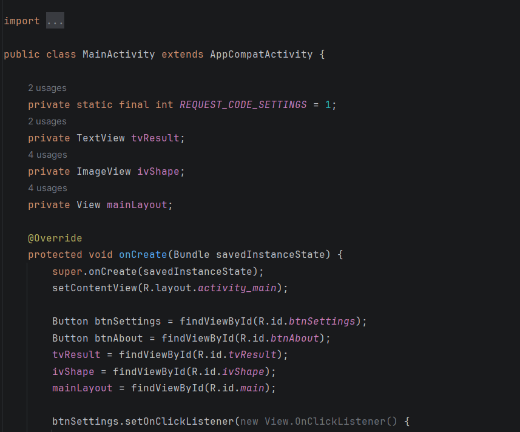
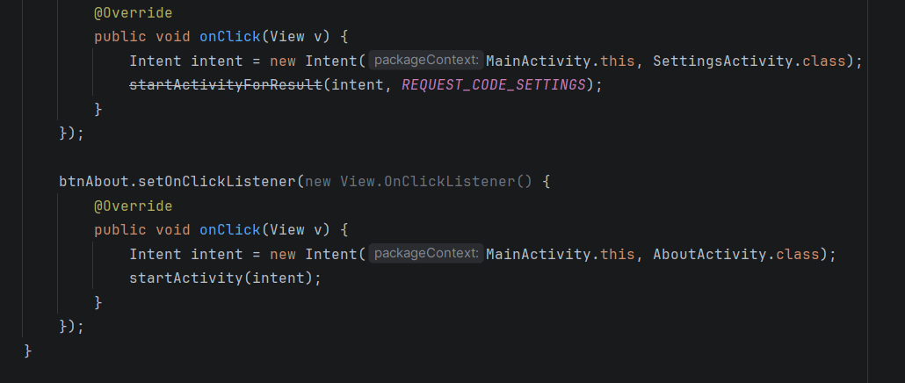
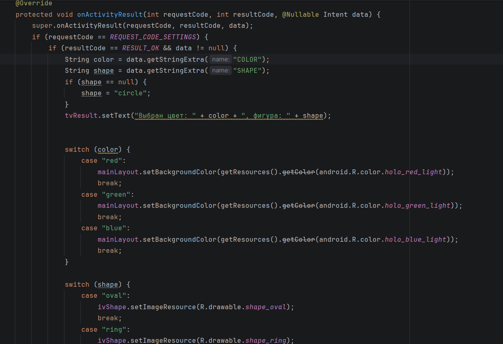
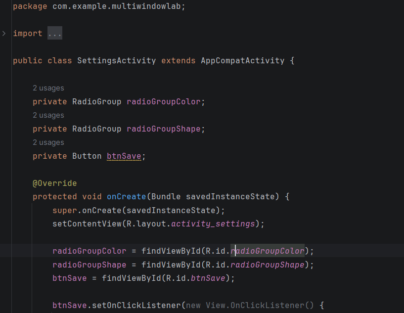
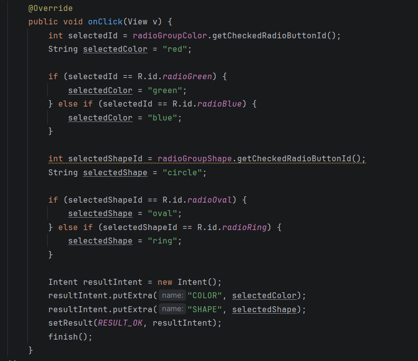
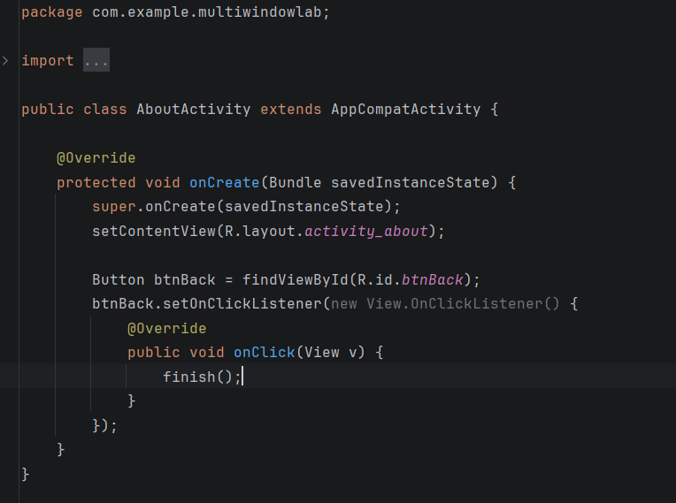
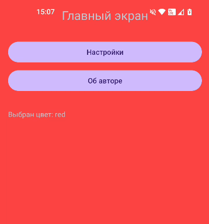

## Отчет

## Практическая работа 5 

## Работа с несколькими окнами (Activity)

---

**ФИО:** Лапшин Никита Евгеньевич  
**Курс:** 2
**Группа:** ИНС-б-о-24-1  
**Направление:** 09.03.02 «Информационные системы и технологии»  

---
### Вариант 9
### Цель работы

Научиться создавать многоэкранные приложения, осуществлять навигацию между активностями (Activity) и передавать данные между ними с использованием объектов Intent и механизма startActivityForResult / onActivityResult.

### Ход работы

  

Рисунок 1 - Класс MainActivity / Создание метода OnCreate

Рисунок 2 - Запуск экрана настройки и "О программе"

Рисунок 3 – 

Рисунок 4 – 

Рисунок 5 – 

Рисунок 6 – 

Рисунок 7 – 

Рисунок 8 – 

Рисунок 9 – 

Рисунок 10 – 
